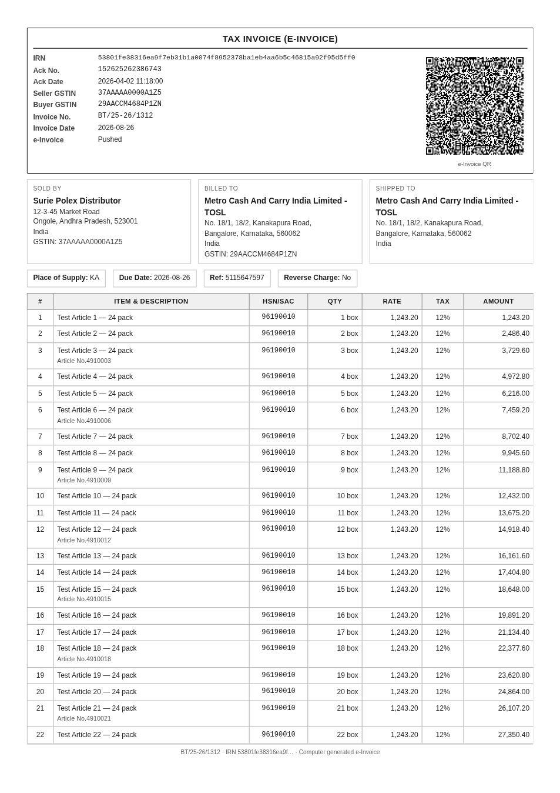
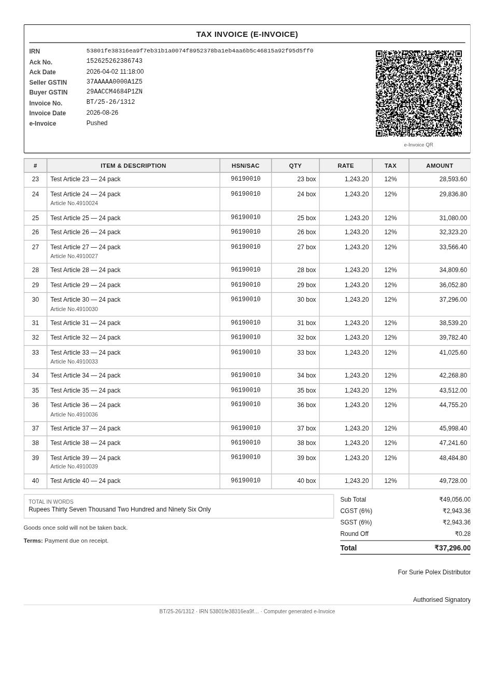

# e-Invoice Print for Zoho Books

A Zoho Books (Sigma) extension that prints an already-completed invoice as an
e-invoice copy, with the **QR code and e-invoice details repeated at the top of
every page**.

Everything comes from the e-invoice Zoho Books already filed when the invoice was
pushed to the IRP. There is nothing to configure and nothing to enter.



Page 2 of the same invoice — the band repeats, it is not a first-page-only header:



## What it does

- Adds a panel to the invoice detail page in Zoho Books.
- Reads `einvoice_details` off the invoice: IRN, Ack No., Ack Date, status and
  the QR image link Books issued.
- Fetches that QR image and inlines it, so a saved PDF stays readable offline.
- Builds a printable A4 document with the e-invoice band in a repeating page
  header, and opens the print dialog.

The extension is read-only. Nothing in Zoho Books is modified.

## What Books actually returns

Confirmed against a live e-invoiced organization:

```json
"einvoice_details": {
  "inv_ref_num":      "53801fe38316ea9f7eb31b1a0074f8952378ba1eb4aa6b5c46815a92f95d5ff0",
  "ack_number":       "152625262386743",
  "ack_date":         "2026-04-02 11:18:00",
  "status":           "pushed",
  "status_formatted": "Pushed",
  "is_cancellable":   false,
  "qr_link":          "https://books.zoho.in/einvoice/qrcode?eInvoiceID=2-48da5c…"
}
```

Two details that drive the implementation:

- **The IRN is `inv_ref_num`**, not `irn` — Books names it after the GST term
  "Invoice Reference Number". Reading `irn` returns nothing.
- **There is no signed-QR string.** Books exposes the QR as an image URL it
  serves itself. So the extension *fetches* the QR; it never generates one.
  That is the right outcome regardless — an e-invoice QR is an IRP signature,
  and anything generated locally would scan but fail validation.

## The one constraint worth knowing up front

**A Sigma extension cannot change how Zoho Books renders its own invoice PDF.**
The Books template engine owns that output, and it places the e-invoice block
once per document, not once per page. So this extension does not try to patch the
Books template — it produces its **own** print layout, which is what makes a
per-page header possible at all.

Practical consequences:

- The printed copy is this extension's layout, not the org's Books template. If a
  customer needs their exact Books template design, the layout in
  `extension/app/js/print-doc.js` has to be matched to it.
- Output goes through the browser's print dialog. There is no server-side PDF
  generation and no automatic attachment back onto the invoice record.
- If an org is content with the QR appearing once, Books does that natively and
  no extension is needed. The gap this fills is the *every page* requirement.

See [docs/ARCHITECTURE.md](docs/ARCHITECTURE.md) for the reasoning in full.

## Installing

- **A customer installing the published extension** — a few clicks from
  Settings, then it works. See [docs/INSTALL.md](docs/INSTALL.md#for-the-customer).
- **You, publishing it from Sigma** — build, test in a real org, then publish
  privately (a link for named orgs) or to the public marketplace. See
  [docs/INSTALL.md](docs/INSTALL.md#for-the-publisher).

## Repository layout

```
extension/
  plugin-manifest.json      widget registration
  app/
    index.html              invoice-detail widget
    settings.html           print appearance only — no data setup
    css/widget.css
    js/
      app.js                widget controller
      settings.js           settings controller
      zf-client.js          ZFAPPS SDK wrapper (invoice, org, Books API)
      einvoice.js           reads einvoice_details off the invoice
      qr-image.js           fetches Books' QR image, inlines it as a data URI
      print-doc.js          builds the printable document
      storage.js            per-org appearance settings
docs/
test/
```

## Tests

```
node test/run.js          # 43 assertions, including the real einvoice_details
                          # payload from a live org, number-to-words, Indian digit
                          # grouping, QR fallback behaviour and HTML escaping
node test/verify-print.js # renders a 70-line invoice to PDF in Chromium and asserts
                          # the e-invoice band lands on every page
node test/preview.js      # writes page images to test/ for eyeballing the layout
```

`verify-print.js` is the check that matters most: the repeating header is the
claim this extension lives or dies by, so it is verified against real pagination
rather than assumed. It needs Playwright; `preview.js` also needs pdf.js.
